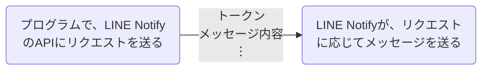

::::details 2024年10月8日追記
:::message
## LINE Notifyのサービス終了について
[LINE Notify](https://notify-bot.line.me/closing-announce)より
>いつもLINE Notifyをご利用いただきありがとうございます。
>
>2016年9月から開発者の皆様に提供してまいりましたLINE Notifyですが、より良いサービスを提供するため、経営資源を後継の類似プロダクトに集中させることとなり、2025年3月31日にサービスを終了させていただくことになりました。LINEを用いた通知連携サービスとして、長年にわたり多くの皆様にご愛顧いただきましたこと、心より感謝申し上げます。
---
>2025年4月1日以降、以下を含むLINE Notifyのすべての機能が利用できなくなります。
>
>- LINE NotifyのすべてのAPI
>   - notify-bot.line.me/**
>   - notify-api.line.me/**
>- LINE Notifyの[マイページ](https://notify-bot.line.me/my/)
>   - サービスの登録
>   - 連携中サービスの確認
>   - アクセストークンの発行
>また、LINE公式アカウント「LINE Notify」（@linenotify）および以下のウェブページは2025年5月12日以降に削除される予定です。
>
>- [LINE Notifyサイト](https://notify-bot.line.me/)
>   - [LINE Notify API Document](https://notify-bot.line.me/doc/ja/)
>- [「LINE Developers Thailand」のLINE Notifyドキュメント](https://linedevth.line.me/th/line-notify)
>- [LINE Notifyヘルプセンター](https://help2.line.me/line_notify/web/?lang=ja)
>- [LINE Notify利用規約](https://terms2.line.me/line_notify_terms_of_use?lang=ja)
---
@[card](https://notify-bot.line.me/closing-announce)
:::
::::
:::message
この記事内のコードは、すべて動作確認をしていますが、万が一エラーが起きたりした場合は、報告お願いします。
:::
## 初めに
今回は、LINE Notifyについての記事を書きたいと思います。
環境によって、エラーが起きてしまうかもしれないので私の環境を書いておきます。
|OS|pythonのバージョン|テキストエディタ|
|--|--|--|
|windows11|3.13.0|visual studio code|
:::::message
当記事は、Pythonはインストール済みという前提で進んでいきますので、インストールしていない方は、以下の手順を参考にしてインストールすることをお勧めします。
※ 当記事を見るだけの方は、インストールする必要はありません。
::::details pythonがインストールされていない場合
:::message
②までは、windows,macOSともに、手順は同じです。
:::
### ① [Download Python | Python.org(Python公式サイト)](https://www.python.org/download/)にアクセス

*Download Python | Python.orgの画像
この画像は2024/9/18のwindows11での画像です。*

-----

### ② Pythonのインストーラーをダウンロード
最新版のインストーラーは、「Download Python x.x.x」と書いてあるボタンを押すと、ダウンロードできます。
そのボタンを押してインストーラーをダウンロードしてください。
:::message
インストーラーは、アプリやソフトウェアをインストールするためのツールです。
インストーラーとPython自体は、別物です。
インストーラーを使って、Pythonをインストールします。
:::

### ③ インストーラーからPythonをインストールする
:::details windowsの場合
②でダウンロードしたインストーラーを開きます。すると「Install Now」という文字や、「Customize installation」という文字の、ボタンが出てくるのですが、それは一度無視して、下にある「Add Python 3.10 to PATH」のチェックボタンを押します。

#### **これ、とても重要です。**

そして、チェックボタンを押した後に、「Install Now」という文字のところを押します。すると、メーターのようなものが出てくるので、それが100%になるとPythonのインストールは完了です。
おめでとうございます!!
:::
:::details MacOSの場合
②でダウンロードしたインストーラーを開きます。
すると、英語でいろいろ書いてありますので、読むか飛ばすかは自由ですが、右下の「続ける」ボタンをクリックします。3段階進むと、右下に、「同意する」というボタンが、表示されたウィンドウが出てくるのでそのボタンを押します。
すると右下に、「インストール」と書かれたボタンが出てくるので、そのボタンを押します。すると、ユーザー名とパスワードを求められるウィンドウが出てくるので、その通りに入力し、「ソフトウェアをインストール」と書かれたボタンを押します。
しばらくすると、「インストールが終了しました」と出てくるので、右下の「閉じる」と書かれたボタンを押して、Pythonのインストールは完了です。
おめでとうございます!!
:::
::::
:::::
## LINE Notifyとは?
最初にLINE Notifyとは何かについて、説明しておきます。
LINE Notifyとは、APIを使って、LINEにメッセージを送信できるシステムです。
LINE Notifyを使った、大まかな流れは、下の図のようになっています。

## 準備
LINE Notifyでメッセージを送る方法はいろいろあると思うのですが、今回はPythonを使いたいと思います。
### LINE Notify公式アカウントを友達追加
#### ① ホーム画面に移動
下の画像の画面から、ホームを選択します。

*LINEのトーク画面*

-----
#### ② アカウント追加画面に移動
ホーム画面で、右上のアカウント追加ボタンを選択します。

*LINEのホーム画面*

-----
#### ③アカウント検索
下の友達追加の画面で、虫眼鏡マークの検索と書かれたものを選択します。

*LINEの友達追加画面*

-----
#### ④ LINE Notifyを友達追加
テキストボックスに、「@LINENotify」と入力して、虫眼鏡のマークを押します。
すると、下の画像のような画面になると思うので、アカウントのアイコンが表示されているところの下の、追加ボタンを押します。

*LINEの友達追加画面*

#### **これでLINE Notify公式アカウントの友達追加は完了です。**

-----

### メッセージ送信用のトークンを取得
#### ① [LINE Notify](https://notify-bot.line.me/)にアクセス
[LINE Notify](https://notify-bot.line.me/my/)にアクセスします。おそらく、最初にアクセスした場合だと、ログインを求められるので、ログインしてください。

*[LINE Notify](https://notify-bot.line.me/my/)の画像*
#### ② トークンを発行
ログインが終わると、トークンを発行するというボタンがあるサイトに行くので、そこでそのボタンを押してください。
押すと、下の画像のような画面が出てくると思うので、事項を入力していきます。
トークン名を記入してくださいという項目には、送信したい時に表示される名前を記入します。
以下の画像のmikann-260の部分を入力しています。

*送信されるメッセージの例*
通知を送信するトークルームを選択してくださいという項目では、LINE Notifyでメッセージを送信したいトークルームを選択してください。
今回は、一番上にある1:1でLINE Notifyから通知を受け取るという項目を選択します。
これは、LINE Notifyの公式アカウントから直接メッセージを受け取るという意味です。
最後に、発行するというボタンを押して、トークンの発行は終了です。
:::message
トークンは、必ずメモしておいてください。
また、メモし忘れた方は、解除ボタンを押して、①からやり直してください。
:::

*トーク画面発行画面*

*トークン発行後の画面
本来は、四角のボックスの中に、発行したトークンが表示されます。*

-----

### ライブラリのインストール
今回の記事では、requestsライブラリを使います。
コマンドプロンプト(Macの方はターミナル)で、
```
py -m pip install requests
```
を実行してrequestsライブラリをインストールします。
```
py -m pip show requests
```
このコマンドを実行して
```
Name: requests
Version: 2.32.3
Summary: Python HTTP for Humans.
︙
```
のように表示されていれば、インストールができています。
逆に
```
WARNING: Package(s) not found: requests
```
と表示されている場合は正しくインストールができていないので、もう一度先ほどのコマンドを実行してください

## 簡単な説明
早くプログラムしたいと思う方もいるかもしれませんが、ここで、これから書くプログラムの説明をしておきます。
requestsライブラリは、PythonでHTTPS通信を行うことができるライブラリです。
また、APIを使うこともできるライブラリで、今回はこの機能を使って実装していきます。
### 通信する際の用語
LINE Notifyを使う際には、はURLとheadersとさらに、payloadを通信します。
requestsライブラリでは、
```python
requests.post(URL=URL,headers=,params=payload)
```
のように、引数を指定します。
#### URL
URLは、簡単に説明すると、ページのデータをもらうための情報みたいなものです。
例えばこのページだと、<https://zenn.dev/mikann_260/articles/mikann-260_articles_001>です。
今回は、URLとして、「 https://notify-api.line.me/api/notify 」を指定します。
#### headers
headersは、Http通信がされる際に、最初に通信される、通信の基本的な情報です。例えば、POSTかGETなどや、URL等が含まれます。
今回は、headersとして、先ほど発行したアクセストークンを指定します。
#### payload
payloadは、送信したいデータで、例えば、今回使うLINE Notifyだと、メッセージの内容や、スタンプのデータです。

-----
これらの通信を行って、LINE NotifyのAPIを使います。
## 実際にプログラム
とりあえず、簡単にメッセージを送信するプログラムを作ってみます。
まず、名前は何でもいいのですが、今回は、LINE_Notify.pyという名前でPythonファイルを作ります。
```Python:LINE_Notify.py
import requests
```
まず、requestsライブラリをインポートします。
そして、このようにプログラムします。
```diff Python:LINE_Notify.py
 import requests
+token = "先ほどメモしたトークン"
+message = "送りたいメッセージ"
+URL = "https://notify-api.line.me/api/notify"
+headers = {"Authorization": f"Bearer{token}"} # headersを変数に定義
+payload = {"message": message} # payloadを変数に定義
+requests.post(url=URL,headers=headers,params=payload)
```
これだけで、メッセージを送ることができます。
tokenは、先ほどメモしたトークンに
messageは、送りたいメッセージの内容に変えてください。
試しに、実行してみましょう。
### 実行結果
プログラムがうまく動作すれば、下の画像のようなメッセージが送られるはずです。

*送られてきたメッセージの例*
送られてきたメッセージの内容は、messageの内容と同じになっているはずです。
### 改良
これで、メッセージを送るプログラムができました。
しかし、このままだと、実行するごとにメッセージの変数を変えなければならないので関数にして使いやすくします。
```diff Python:LINE_Notify.py
+def send(token:str, message:str) -> None :
   import requests
-token = "先ほどメモしたトークン"
-message = "送りたいメッセージ"
   URL = "https://notify-api.line.me/api/notify"
   headers = {"Authorization": f"Bearer{token}"} # headersを変数に定義
   payload = {"message": message} # payloadを変数に定義
   requests.post(url=URL,headers=headers,params=payload)
```
1行目にdefキーワードに追加して、トークンとメッセージの内容を引数として指定しています。
3,4行目を削除します。
そして、import requestsの行を2行目に移動させます。
そしてそれ以降のプログラムをすべて一段階インデントします。
すると、このようなプログラムになると思います。
```Python:LINE_Notify.py
def send(token:str, message:str) -> None :
  import requests
  URL = "https://notify-api.line.me/api/notify"
  headers = {"Authorization": f"Bearer {token}"} # headersを変数に定義
  payload = {"message": message} # payloadを変数に定義
  requests.post(url=URL,headers=headers,params=payload)
```
関数を使うときは、
```Python:LINE_Notify.py
send(
  token="先ほどメモしたトークン",
  message="テストメッセージ"
  )
```
のように記述します。
:::details 関数の引数を指定する()の横に「-> None」と記述している理由
Pythonで関数を作る際に引数に指定することができる->はアノテーションと呼ばれるもので、その関数の返り値のデータ型を表しています。
アノテーションは付けてもつけなくても大丈夫です。
データ型は正しくなくてもエラーは起きませんが、使いにくくはなってしまうと思います。
データ型というのは、データの種類のことです。
下の表のようなデータ型があります。
|str|int|float|bool|list|tuple|
|---|---|-----|----|----|-----|
|文字列のデータ型<br>例<br>"文字列"|整数のデータ型<br>例<br>123|小数点を含む数のデータ型<br>例<br>3.14|真か偽のデータ型<br>例<br>True<br>False|複数の値が入ったリスト<br>タプル(tuple)との違い･･･中身の変更ができるか<br>リストは中身の変更ができる<br>例<br>["a","b",1,2,3.14]|複数の値が入った変数のようなもの<br>リストとの違い･･･中身の変更ができるか<br>タプルは中身の変更ができる<br>例<br>("a","b",1,2,3.14)

他にもデータ型はありますが、それは調べたり下の記事を見たりしてみてください
https://zenn.dev/datasciencekun/articles/837bb12cf937f8#%E6%A8%99%E6%BA%96%E3%83%87%E3%83%BC%E3%82%BF%E5%9E%8B
:::
:::details 引数を指定している際の「token:str」を記述している理由
これは、その引数に指定することができるデータ型の種類を示しています。
また|で区切ることで2つ以上の指定もできます。
引数に、これ以外のデータ型の物を入力すると、エラーになります。
データ型というのは、データの種類のことです。
下の表のようなデータ型があります。
|str|int|float|bool|list|tuple|
|---|---|-----|----|----|-----|
|文字列のデータ型<br>例<br>"文字列"|整数のデータ型<br>例<br>123|小数点を含む数のデータ型<br>例<br>3.14|真か偽のデータ型<br>例<br>True<br>False|複数の値が入ったリスト<br>タプル(tuple)との違い･･･中身の変更ができるか<br>リストは中身の変更ができる<br>例<br>["a","b",1,2,3.14]|複数の値が入った変数のようなもの<br>リストとの違い･･･中身の変更ができるか<br>タプルは中身の変更ができる<br>例<br>("a","b",1,2,3.14)

他にもデータ型はありますが、それは調べたり下の記事を見たりしてみてください
https://zenn.dev/datasciencekun/articles/837bb12cf937f8#%E6%A8%99%E6%BA%96%E3%83%87%E3%83%BC%E3%82%BF%E5%9E%8B
:::
()の中で、改行しているのは、見やすくするだけなので改行なしでも大丈夫です。
:::message
改行できるのはカンマ(,)があるところだけです。
他のところで改行するとエラーが起きるので、注意して使ってください。

良い例
```Python
send(
  token="先ほどメモしたトークン",
  message="テストメッセージ"
  )
```
悪い例
```Python
  send(
  token="先ほどメモ
  したトークン",
  message="テストメッセージ"
  )

```
:::
### 応用
前回までの章でメッセージは送ることができました。
しかし、画像やスタンプを送りたいと思うこともありますよね?
なので、応用として、画像やスタンプを送る機能をメッセージを送ることができる関数に追加していきながらその方法を紹介します。
メッセージを送るという点では変わらないので、そんなに難しくないですが気になる方はやってみてください。
※ 画像や、スタンプの送信を送る際には、必ずメッセージも送信しなければなりません。
#### 画像
画像を送る際は、APIを使う際にPythonのファイルオブジェクトも一緒に送るとよいです。
これから、具体的に実装していきます。
まず、先ほど作った関数をすべて下にコピーします。
そして、関数名をわかりやすくimg_sendにします。
まず、先ほど作った関数にファイルのパスを指定してもらうように引数を作ります。
そして、ファイルのパスが入力された際には、ファイルの項目もAPIに使うようにプログラムします。
```diff Python:LINE_Notify.py
+def img_send(token:str, message:str, image_path:str|None) -> None :
   import requests
   URL = "https://notify-api.line.me/api/notify"
   headers = {"Authorization": f"Bearer {token}"} # headersを変数に定義
   payload = {"message": message} # payloadを変数に定義
+  if not image_path == None :
+    image = {'imageFile': open(image_path, 'rb')}
   requests.post(
     url=URL,
     headers=headers,
     params=payload,
+    files=image
     )
```
これは、if not image_path == None :のところで、image_path引数に数値が入力されているかをチェックして、入力されていれば、imageという変数に、API用の、情報を入れています。
また、files=imageのところで、メッセージに加えて、画像の情報が入った変数をAPIに送っています。

*送信される画像の例*
#### スタンプ
スタンプの場合は、payloadにスタンプの情報を入れると、送信することができます。
これから、実際に実装していきます。
具体的にいうと、スタンプのパッケージのIDとスタンプ単体のIDです。
まず、先ほど作った関数をすべて、下にコピーします。
そして、分かりやすいように関数名をsticker_sendにしておきます。
スタンプの情報を引数に入力してもらうように引数を追加します。
そして、payloadに、スタンプの情報を入れて、postしています。
```diff Python:LINE_Notify.py
+def sticker_send(token:str, message:str, stickerPackageID:int, stickerId:int) -> None :
   import requests
   URL = "https://notify-api.line.me/api/notify"
   headers = {"Authorization": f"Bearer {token}"} # headersを変数に定義
+  payload = {
+    "message": message,
+    "stickerPackageId": PackageID, # payloadを変数に定義
+    "stickerId": stickerId
+    }
   requests.post(url=URL,headers=headers, params=payload)
```

*送信されるスタンプの例*
説明していなかったのですが、スタンプのIDは、[スタンプ | LINE Developers](https://developers.line.biz/ja/docs/messaging-api/sticker-list/#sticker-definitions)から、見ることができます。
下の画像でいう、パッケージIDが、今作った関数の引数のstickerPackageIDにあたり、スタンプのイメージがあるところの下のものが関数の引数のstickerIdになります。

*スタンプ | LINE Developersの画像*
## 最後に
今回は、LINE NotifyをPythonのrequestsライブラリを使って、使う方法を解説しました。
今回紹介した、機能以外にも下の表のようなこともできます。
:::details 機能一覧
|パラメータ名|必須|型|説明|
|-|-|-|-|
message|必須|String|最大 1000文字|
imageThumbnail|省略可能|HTTPS URL	最大 240×240px / JPEG のみ許可されます|
imageFullsize|省略可能|HTTPS URL|最大 2048×2048px / JPEG のみ許可されます|
imageFile|省略可能|File|LINE上の画像サーバーにアップロードします。<br>対応している画像形式は、png, jpegです。<br>imageThumbnail/imageFullsizeと同時に指定された場合は、imageFileが優先されます。<br>1時間にuploadできる量に制限があります。|
|stickerPackageId|省略可能|Number|パッケージ識別子。<br>Stickerの識別子は以下を参照ください。<br>[Sticker一覧](https://developers.line.biz/ja/docs/messaging-api/sticker-list/)|
|stickerId|省略可能|Number|Sticker識別子|
|notificationDisabled|省略可能|Boolean|true: メッセージ送信時に、ユーザに通知されない。<br>false: メッセージ送信時に、ユーザに通知される。ただし、LINEで通知をオフにしている場合は通知されません。<br>デフォルト値は false です。|

[LINE Notify](https://notify-bot.line.me/doc/ja/)より
:::
例えば、Payloadを以下のようにして、通知音がならないようにする(ラインアプリでいうミュートメッセージ)のようにもできるということです。
```diff Python:LINE_Notify.py
 payload = {
   "message": message,
   "notificationDisabled": true
 }
```
今回の記事でできたPythonファイルはGitHubに公開しています。
@[card](https://github.com/mikann-260/Articles-and-book-codes/blob/main/Articles/【Python】requestsライブラリを使ってLINEのメッセージを送る/LINE_Notify.py)
##### ※ GitHubのコードは、関数のみのファイルですので、関数の呼び出しは、自分でプログラムしてください。

## 参考
@[card](https://qiita.com/moriita/items/5b199ac6b14ceaa4f7c9#line-notify)
@[card](https://notify-bot.line.me/doc/ja/)
